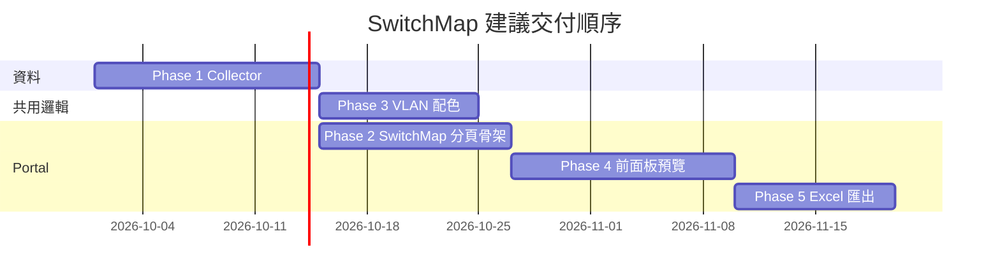

# SwitchMap 分階段整合計畫（SwitchDraw → NCCM v3）

**產品名稱：** SwitchMap（Portal 分頁標籤；舊內部代號 switchdraw / drawswitch）  
**撰寫日期：** 2026-09-30  
**狀態：** 規劃文件 — **尚未實作功能**

## 摘要

將 [SwitchDraw v1.1.5](https://github.com/moltmotl5-bot/switchdraw) 的 Cisco 交換器前面板埠位圖能力，嵌入 NetdriveBackup（NCCM v3）備份與 Portal 流程。資料來源改為 NCCM 快照 artifacts，而非手動 PuTTY 整段 log；UI 以新分頁 **SwitchMap** 呈現，取代獨立靜態站或僅連結外部工具。

**相關評估：** [PR #9 — drawswitch merge](https://github.com/moltmotl5-bot/NetdriveBackup/pull/9) 內 [`docs/drawswitch-merge-assessment.md`](https://github.com/moltmotl5-bot/NetdriveBackup/blob/cursor/drawswitch-merge/docs/drawswitch-merge-assessment.md)（策略選項、現況差距、過渡用法）。  
**內部差距表：** Agent Store `internal/switchdraw-vs-nccm-gap.md`。

## 範圍與限制

| 項目 | 說明 |
|------|------|
| **支援廠牌** | Phase 1–5 均以 **Cisco IOS / IOS-XE（含堆疊）** 為主；Nexus 可列 Phase 1 子項（指令差異），Huawei/Fortinet **不在本計畫 MVP** |
| **輸出** | HTML 前面板預覽 + Excel `.xlsx`（Ports / VLANs / 前面板工作表）；無 SVG/PNG/PDF（若 Leo 日後需要另開 Phase） |
| **解析位置** | 中短期：**瀏覽器** vendored SwitchDraw JS（與 upstream 行為一致）；長期可選伺服器端批次 XLSX |
| **授權與部署** | 以 vendored 靜態資源或 submodule 追 tag；單一 Docker 映像可離線 |

## 建議合併／交付順序

使用者敘述 Phase 1→5 為產品敘事順序；**技術交付建議**如下（Phase 4 明確要求 VLAN 色先於其他樣式，故 Phase 3 必須在 Phase 4 之前完成）。

| 順序 | Phase | 理由 |
|------|-------|------|
| **1** | Collector | 無完整 artifacts 則 SwitchDraw 解析缺 VLAN 名稱、description、neighbor detail |
| **2** | VLAN 配色（原 Phase 3） | 預覽與 Excel 共用 registry；Leo 要求「色碼優先於其他 styling」 |
| **3** | SwitchMap 分頁（原 Phase 2） | 可與 Phase 3 部分並行：先路由／導覽／設備選擇，再接資料 API |
| **4** | 前面板預覽（原 Phase 4） | 依賴 parse + colorRegistry + Portal shell |
| **5** | Excel 匯出（原 Phase 5） | 重用 `workbook.js` / ExcelJS，與預覽同一 `device` 物件 |

**PR 對照（建議）：** PR #9（評估，已存在）→ PR+1 Collector → PR+2 SwitchMap 分頁 + log 合成 API → PR+3 VLAN 配色強化 → PR+4 預覽 → PR+5 Excel；若人力允許可將 PR+2 與 PR+3 合併為一個中等 PR。

---

## Phase 1：Collector（備份收集器擴充）

### 目標

讓 NCCM 每次 Cisco 備份快照包含 SwitchDraw 解析管線所需的 **完整 CLI 輸出**，並以 **穩定 artifact 檔名** 寫入 `snapshots/{ts}/`，供後續 log 合成器或直讀解析器使用。

### 範圍

- 僅修改 **Cisco** `cisco_backup_commands()`（IOS/XE 與 Nexus 分支分開評估）。
- 新增 artifact 檔案；既有 `config.txt`、`interfaces.txt` 等 **不變更指令語意**。
- 失敗時沿用現有 **soft-skip**（指令不支援／timeout 不拖垮整次備份）。
- **不在此 Phase** 實作 Portal UI 或 SwitchDraw JS。

### 需新增的 show 指令與快照檔案

與 SwitchDraw README / `fixtures` 對齊；NCCM 慣例為 `{artifact}.txt`，檔首可保留既有 `# NCCM command: ...` 標頭（合成 log 時需 strip 或註明）。

| Artifact 名稱（建議） | Cisco IOS / IOS-XE 指令 | 用途（SwitchDraw / SwitchMap） |
|----------------------|-------------------------|--------------------------------|
| `config`（已有） | `show running-config view full`（Nexus：`show running-config`） | 介面 mode、access/trunk VLAN、description、hostname |
| `interfaces`（已有） | `show interface status` | 埠 Status / VLAN / Speed / Type |
| `stack_info`（已有，非 Nexus） | `show switch` | 堆疊 member → 前面板分 sheet |
| `version_info`（已有） | `show version` | 型號、軟體（輔助） |
| **`interfaces_description`**（新增） | `show interfaces description` | 埠描述列（與 config 互補） |
| **`ip_interface_brief`**（新增） | `show ip interface brief` | L3/routed 埠辨識 |
| **`vlan_brief`**（新增） | `show vlan brief` | VLAN ID ↔ 名稱、** onboarded VLAN 集合** |
| **`cdp_neighbors`**（擴充或雙寫） | `show cdp neighbors detail` | 每埠 neighbor（SwitchDraw 可吃 detail；現為 brief） |
| **`lldp_neighbors`**（擴充或雙寫） | `show lldp neighbors detail` | 同上 |

**CDP/LLDP 策略（擇一，於實作 PR 定案）：**

- **A（推薦）：** artifact 改為 detail；`nccm/parsers/cdp_lldp.py` 增強解析 detail 並 **向後相容** brief。
- **B：** 保留 brief 檔名，另增 `cdp_neighbors_detail.txt` / `lldp_neighbors_detail.txt`；合成器只取 detail。

**Nexus 備註：** SwitchDraw 目標為 IOS/XE；Nexus 若無 `show vlan brief` 等價指令，該 artifact **soft-skip**，SwitchMap UI 標示「此型號不支援 SwitchMap」。

**不納入備份、但 PuTTY log 常見的前置指令：** `terminal length 0` / `terminal width 0` — 由 NetDriver session 或 agent 處理；合成 log 時可插入註解行或不插入（SwitchDraw 解析不依賴）。

### 驗收標準

- [ ] 對 lab Catalyst 設備一次備份後，快照目錄含上表 **全部新增** artifact（或 manifest 標記 skipped 與原因）。
- [ ] 既有 `/interfaces`、`/neighbors` 在缺新檔時行為不變；有新檔時 neighbors 資訊不少於現況。
- [ ] `manifest.json` 的 `artifacts[]` 列出新增項與 line count。
- [ ] 文件更新：`docs/NCCM-v3-spec.md` 或 Handbook 備份欄位表。

### 依賴

- NetDriver Agent Cisco 插件可執行上述 show（權限 login/enable 已滿足）。
- 無 SwitchMap UI 依賴。

### 風險

| 風險 | 緩解 |
|------|------|
| 備份時間變長（detail + 多指令） | 個別 `CommandSpec.timeout`；soft-skip |
| 舊快照無新 artifact | 合成 API 降級提示「請重新備份」；Interface Map 仍可用 |
| 前面板連線狀態空白 | **優先** `interfaces.txt`（`show interface status`）→ **其次** `interfaces_description.txt` 的 Status/Protocol；Phase 1 前若缺 `interfaces_description` 仍可用既有 `interfaces.txt`；兩者皆缺或為空時 UI 顯示「—」並提示重新備份 |
| CDP/LLDP 解析 regression | pytest 加 brief + detail golden fixtures |

### 主要程式觸點

| 模組 | 變更 |
|------|------|
| `nccm/profiles/__init__.py` | `cisco_backup_commands()` 新增 `CommandSpec` |
| `nccm/backup/runner.py` | 確認 soft-skip 日誌與 manifest |
| `nccm/storage/writer.py` | 無需改（artifact 名即檔名） |
| `nccm/parsers/cdp_lldp.py` | 若採 detail：擴充解析 |
| `tests/` | 備份命令列表 snapshot test |

---

## Phase 2：SwitchMap 分頁（Portal 產品殼層）

### 目標

在 NCCM Portal 新增頂級導覽 **「SwitchMap」**，提供設備／快照選擇、載入解析資料、嵌入 SwitchDraw 前端模組的 **正式入口**（產品名 SwitchMap，路由與模板命名與舊名 switchdraw 脫鉤）。

### 範圍

- 側邊欄 `NAV` 新增一項（建議放在 **Interface Map 下方** 或替換為子入口 — **建議獨立分頁** 以免 HTMX 表格與 canvas 混雜）。
- 路由：`GET /switchmap`（英文 slug；UI 繁中「SwitchMap」或「交換器埠位圖」副標）。
- **認證：** 沿用 `SessionGateMiddleware`；`viewer` 可讀、`operator/admin` 與現有 inventory 一致（若 Leo 要求僅 operator 可匯出，於 Phase 5 加細部權限）。
- **資料 API（草圖）：**
  - `GET /switchmap` — Jinja 主頁：站點／設備下拉、最新快照時間、Cisco-only 篩選。
  - `GET /switchmap/partial/device-picker` — HTMX partial（可複用 inventory 查詢模式）。
  - `GET /api/v1/devices/{device_id}/snapshots/latest/switchdraw-log` — **合成 PuTTY 相容 log**（artifact 依 SwitchDraw 指令順序拼接）；需 API token scope 新設 `switchmap:read` 或沿用 `inventory:read`（PR 定案）。
  - 或 Portal session：`GET /switchmap/devices/{device_id}/log?snapshot=...` 回傳 `text/plain`（避免將大 log 塞進 HTML）。
- 靜態資源：`web/static/switchmap/`（vendored `parse.js`, `faceplate.js`, `workbook.js`, `exceljs`, `switchmap.css`）— 由 `switchmap.html` 以 `type=module` 或 IIFE 載入。
- **不在此 Phase：** 完整前面板預覽／Excel（可顯示 placeholder「Phase 4」）。

### 驗收標準

- [ ] 登入後側欄可進入 SwitchMap；未登入導向 `/login`。
- [ ] 選擇 Cisco 設備後可下載或 fetch 合成 log，內容含 `show running-config` … `show lldp neighbors detail` 順序與 SwitchDraw fixture 相容。
- [ ] 非 Cisco 設備顯示友善說明，不載入 JS 解析器。
- [ ] CSRF／security headers 與其他頁一致。

### 依賴

- **Phase 1** 完成後合成 log 資訊完整；Phase 1 未完成前 API 可 mock／部分 artifact 缺失警告。

### 風險

| 風險 | 緩解 |
|------|------|
| Log 合成與 SwitchDraw 邊界不一致 | golden test：合成 log 餵 `parseLog()` 與 upstream fixture 比對 hostname/port 數 |
| 大 log 記憶體 | 僅 latest 快照；可 gzip 下載 optional |
| 命名混淆 switchdraw | 程式目錄用 `switchmap`，註解標 upstream SwitchDraw |

### 主要程式觸點

| 模組 | 變更 |
|------|------|
| `web/main.py` | `NAV`、`/switchmap` routes、log 合成 helper |
| `web/templates/switchmap.html` | 新模板 extends `base.html` |
| `web/templates/base.html` | 無 structural 變更（僅 nav 資料來源） |
| `web/api.py` 或 `web/switchmap_api.py` | REST log endpoint |
| 新：`nccm/switchmap/log_builder.py` | artifact → synthetic PuTTY log |
| `web/static/switchmap/*` | vendored JS（Phase 4/5 用） |

---

## Phase 3：VLAN 配色（onboarded VLAN 唯一 cell + 文字色）

### 目標

為每台設備解析結果中的 **onboarded VLAN** 指派 **唯一的（儲存格底色 + 文字色）組合**，同一 VLAN ID 在圖例、前面板、VLANs 工作表一致，且 **不同 VLAN 之間不重複**（在 onboarded 集合內）。

### 範圍

- **Onboarded VLAN 定義（建議）：** 出现在 `show vlan brief` 解析結果中的 VLAN ID（含預設 VLAN 1）；若該 artifact 缺失，則 fallback 為所有 access 埠的 `accessVlan` 聯集（並 UI 警告）。
- 擴充 SwitchDraw `createColorRegistry()` 概念：
  - 除 fill palette 外，為每個 VLAN 指派 **textColor**（例如依 fill 亮度選黑/白，或從預定義 **配對表** 取唯一 pair）。
  - trunk / shutdown / routed / err-disable 等 **特殊態** 仍用固定 special 色（不占用 VLAN pair 名額）。
- **持久化（建議分級）：**
  - **L1（MVP）：** 每 device × snapshot 執行期 registry（與 SwitchDraw 相同）— 同一快照內穩定。
  - **L2（Leo 若需跨次備份一致）：** site 或 global JSON/SQLite `vlan_color_assignments(vlan_id → fill, text)`，新 VLAN  onboarding 時原子配置下一個未用 pair；刪除 VLAN 可保留或回收（PR 定 policy）。
- **無障礙：** 每 pair 需滿足 WCAG AA contrast（正文 vs fill）；無法滿足時 fallback 下一 pair 並記錄 log。

### 驗收標準

- [ ] 單設備 20+ VLAN lab fixture：所有 onboarded VLAN 的 `(fill, text)` 兩兩不同。
- [ ] 同一 VLAN 在預覽與 Excel（Phase 5）顏色一致。
- [ ] palette 用盡時明確錯誤或擴表策略（文件化），不 silent 重複。
- [ ] 對比度檢查單元測試（JS 或 pytest 若邏輯移植）。

### 依賴

- Phase 1 的 `vlan_brief` 使 onboarded 集合完整。
- Phase 2 可選（registry 可在 static JS 單元測試）。

### 風險

| 風險 | 緩解 |
|------|------|
| 全域持久化與 SwitchDraw upstream 漂移 | fork `faceplate.js` → `switchmap-colors.js` 並註明 diff |
| VLAN ID 超過 palette | 擴充配對表或 hash 衍生（需仍保證唯一性） |

### 主要程式觸點

| 模組 | 變更 |
|------|------|
| `web/static/switchmap/faceplate.js`（或 wrapper） | `createColorRegistry`、contrast helper |
| 可選：`nccm/switchmap/vlan_colors.py` + DB | L2 持久化 API |
| `web/main.py` / API | GET/PUT site VLAN color map（若 L2） |

---

## Phase 4：前面板預覽（SwitchDraw「前面板預覽」移植）

### 目標

在 SwitchMap 分頁呈現與 SwitchDraw 等效的 **HTML 前面板預覽**（奇偶埠上下排、堆疊分 member 區塊、VLAN 色 + Port Status 雙列），且 **渲染順序上先套用 Phase 3 VLAN 配色**，再套用 port status / 邊框等次要樣式。

### 範圍

- 移植 `js/app.js` 的 `renderPreview` / `renderPortBox` 至 Portal 版（可抽 `switchmap-preview.js`）。
- 資料流：`fetch(log)` → `SwitchDraw.parseLog` → `enrichDevice`（含 colorRegistry）→ render `#switchmap-preview`。
- 從 Interface Map **連結**：`/interfaces` 設備列加「在 SwitchMap 開啟」deep link（`?device_id=`）。
- CSS：移植 `css/app.css` 必要部分至 `web/static/switchmap/switchmap.css`，色票以 CSS variables 接 registry  inline style（與 SwitchDraw 一致）。
- **不做：** Excel 下載按鈕邏輯完整化可留 Phase 5（可先 disabled）。

### 驗收標準

- [ ] 使用 NCCM 合成 log（Phase 1+2）渲染結果與 SwitchDraw 靜態站同一 fixture **視覺一致**（允許字體差異）。
- [ ] 變更 access VLAN 後（新快照）配色隨 registry 更新；trunk 埠不誤用 VLAN 色。
- [ ] 解析失敗顯示繁中錯誤與缺 artifact 提示。

### 依賴

- Phase 2（頁面 + log）、Phase 3（配色）、Phase 1（資料）。

### 風險

| 風險 | 緩解 |
|------|------|
| JS 全域命名衝突 | `SwitchMap` namespace 包裝 |
| HTMX 與 full page JS lifecycle | SwitchMap 用獨立 block scripts，避免 htmx swap 破壞 preview |

### 主要程式觸點

| 模組 | 變更 |
|------|------|
| `web/static/switchmap/switchmap-preview.js` | 由 `app.js` 改寫 |
| `web/templates/switchmap.html` | preview 容器、載入按鈕 |
| `web/templates/interfaces.html` | deep link（小改） |
| `web/static/switchmap/switchmap.css` | 前面板 layout |

---

## Phase 5：Excel 匯出

### 目標

在 SwitchMap 提供 **「下載 Excel 埠位圖（.xlsx）」**，工作表結構與 SwitchDraw 一致：**前面板**（每 stack member）、**Ports**、**VLANs**；VLAN 色使用 Phase 3 registry（fill + 字色）。

### 範圍

- 重用 vendored `workbook.js` + `ExcelJS`（`vendor/exceljs.bare.min.js`）。
- 檔名慣例：`{hostname}-switchport.xlsx`（與 SwitchDraw 相同）。
- 安全說明：無 VBA、無公式、無外部連結（Handbook / 頁腳沿用 SwitchDraw SECURITY 文案）。
- 可選：**僅 operator+** 可下載（audit log 記錄 export 事件）。
- **不在此 Phase：** 伺服器端排程批次 XLSX（另案）。

### 驗收標準

- [ ] 下載 xlsx 可被 Microsoft 365 / LibreOffice 開啟；sheet 名稱與 SwitchDraw golden 一致。
- [ ] `npm test`（switchdraw upstream）或移植 test 在 CI 跑 parse + workbook 煙霧測試。
- [ ] VLANs sheet 色塊與預覽一致；onboarded VLAN 無重複 pair。

### 依賴

- Phase 4 同一 `currentDevices` 狀態；Phase 3 配色。

### 風險

| 風險 | 緩解 |
|------|------|
| ExcelJS 體積 | 已 vendored；FastAPI static cache headers |
| 防毒誤報 | 文件 + 無巨集；必要時提供 CSV fallback（非 MVP） |

### 主要程式觸點

| 模組 | 變更 |
|------|------|
| `web/static/switchmap/workbook.js` | 接入 textColor |
| `web/static/switchmap/switchmap-app.js` | download handler |
| `nccm/auth/audit.py` | 可選 export 稽核 |

---

## 總覽表

| Phase | 名稱 | 核心交付 | 阻塞 |
|-------|------|----------|------|
| 1 | Collector | 7+ artifact 指令集 | — |
| 2 | SwitchMap 分頁 | 路由、auth、log API、static 殼 | 1（部分可並行） |
| 3 | VLAN 配色 | 唯一 fill+text pair、onboarding 定義 | 1 |
| 4 | 前面板預覽 | HTML preview | 2, 3 |
| 5 | Excel 匯出 | xlsx 三類工作表 | 4 |

## 測試策略

| 層級 | 內容 |
|------|------|
| **pytest** | log_builder 合成、CDP detail 解析、備份 command list |
| **Node（switchdraw test）** | 移植或 submodule 執行 `parse.test.js` + workbook 煙霧 |
| **E2E** | Portal 登入 → SwitchMap → 選設備 → 預覽 → 下載 xlsx |
| **Golden** | `fixtures/sample-cisco.log` + NCCM 合成 log 對照 |

## 參考

- SwitchDraw：https://github.com/moltmotl5-bot/switchdraw（tag v1.1.5）
- NCCM 評估 PR：https://github.com/moltmotl5-bot/NetdriveBackup/pull/9
- Interface Map：`nccm/parsers/interface_map.py`、`web/templates/interfaces.html`
- Cisco 備份：`nccm/profiles/__init__.py` → `cisco_backup_commands`

---

*本文件為 Leo 要求的分階段整合計畫；實作 PR 請依「建議合併／交付順序」拆分，並於各 PR 連回本文。*
